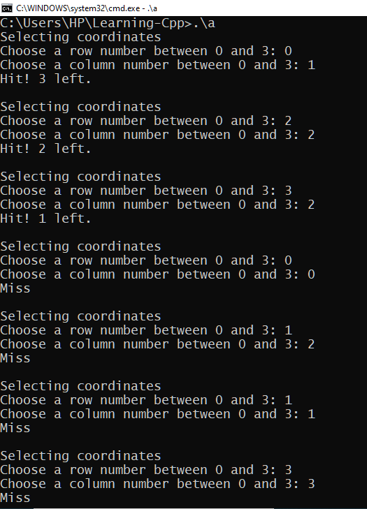

# Learning-Cpp
My Everyday Progress of Learning Cpp

## Day 1
1. Setup mingw and other toolkit for compiling
	You can get all the instructions from here:
	https://www.msys2.org/
3. Create [hello world program](hello.cpp)  

          using namespace std;
	Using this code after **include <iostream">** would eliminate the use of **std::** at various lines
	
	As you may have noticed, the **main** function is of the **int** type, and so we need to return an integer value by programming logic. Hence we use **0** as the default return value.

	Ways to display output are:

		std::cout<<"Hello World"";		(if not using the above code)
		cout<<"Hello World";
		cout<<"Hello World"<<endl;		(for a new line)
4. Use mathematical operations with type conversion
Ways to initialize data types are:

		int a=10;
		double b=1.0001;
		char c = 'a';
		string d = "myString";
	You can also initialize **char** data type by using the ASCII value:
	
		char c = 68;
	Some notes regarding mathematical functions::
						
		1. '%' operand works only on *int* data type.
		2. '/' needs the data types to be converted to *double* for exact output, or else it produces an *int* output.
5. Use **[for](forloop.cpp)** loop
	This loop is written with the first command as the **initializing value**, the second command as the **limiting value** and the third command as the **step-wise increment/decrement**:
	   
	   for(int i=1; i<=10; i++)
	This code will print the numbers starting from 1 to 10 with increase as 1. You can decrease the value by using:

		i--
	If you want to have step other than one, you can use:

		i=i+2		or 		i=i-2
		or some other value
6. Use **[switch case](switchcase.cpp)**
	It uses a conditional value to check for equality

		switch(a)
	It then searches for the command, here **case**, that corresponds to the value and executes the command

		case 1:
		//line of code
		break;
	**break** command makes the machine stop when the code for the particular case has been run. Else it will execute the next command as well. Try running the below code inside the **main** class.

		int a=1;
		switch(a)
		{
			case 1:
			cout<<"One";
			case 2:
			cout<<"Two";
			case 3:
			cout<<"Three";
			case 4:
			cout<<"Four";
		}

## Day 2
1. Using [array](arrayList.cpp) with sizeof() function
	We can define by using 

		[data type] variable_name [size] = {value1, value2, ...};
		int array[5] = {1, 2, 3, 4, 5};
		
		//you can also define an array without giving a size
		int a[] = {1,2,3,4};		this creates an array of dynamic size 4
	We can pull the size of an array by using the **sizeof(array_name)** function.
	**Note** : sizeof() function returns the value as **bytes** and not **int**.
	We can convert it to **int** by dividing the value with the size of the data type used

		int arrayLen = sizeof(myArray)/sizeof(int);
		int arrLen = sizeof(Array2)/sizeof(string);
	Something that I have noticed is that using the size function with regards to some loop or case function does result in various errors. Hence, it is better to use a variable to store the size variable rather than defining it in continuity.

		for(int a = 0; a < (sizeof(myArray)/sizeof(int)); a++)
		*The above code gives error.*

		int len = sizeof(myArray)/sizeof(int);
		for(int a = 0; a < len; a++)
		*This has no errors.*
2. [Two-dimensional array](two_d_array.cpp) and it's uses
We can define a two-dimensional array the way we define two arrays. Each array defines each row of the two-dimensional array.

		[data_type] variable_name [no. of rows][no. of elements in each row] = { {rowA1, rowA2, ...}, {rowB1, rowB2,....}};
		int doubleArray [2][3] = {{1,2,3}, {4,5,6}};
	All the values inside a two-dimensional array **should have the same data type**.
3. Make a [text based game](two_d_game.cpp).
A text based battleship game using all the concepts we have known and dealt so far.

4. [Structure](structure.cpp) with the help of person reference
Structure helps in defining objects that have similar behaviour throughout their approach. It can also be viewed as an array that supports different data types for it's **member variables**. You can define a structure as:

		struct{				||		struct {
		[data_type] member1; 		||		int age;
		[data_type] member2;		||		string name;
		[data_type] member3;		||		string address;
		} struct_name;			||		} person;
> Written with [StackEdit](https://stackedit.io/).
